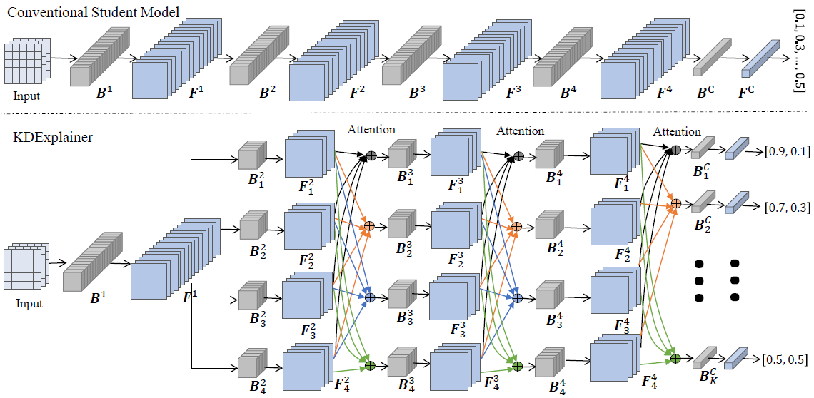

# KDExplainer: A Task-oriented Attention Model for Explaining Knowledge Distillation
Here provided a PyTorch implementation of the paper:[KDExplainer: A Task-oriented Attention Model for Explaining Knowledge Distillation](https://arxiv.org/pdf/2105.04181).

> **Note**:  In this paper introduces a novel task-oriented attention model, termed as KDExplainer, to shed light on the working mechanism underlying the vanilla KD. Example codes are all in the folder.

## Training Configs
Example configs are all in the folder `/configs`.

The training of networks begin with loading config files. You can choose different config files according to different datasets. 
The config files of training teacher networks are in the folder `valina`. 

The config files of training student networks are in the folder `kd`.

## Pre-Trained Teacher Networks
The net structure of teachers can be set in config file. The code provids several models, more details are provided in the `models` folder.
Use `train_teacher.py` to train teachers.

- `--config`: String. The config file path to be loaded, default `./config/train_ResNet50.yml` 
- `--logdir`: String. The dirtory of log flie, default `./log_teacher` 
- `--file_name_cfg`: String. The config file name to be loaded, default `train_ResNet50.yml` 

If you don't set parameters in terminal, you can set in corresponding code.

## Train LTB Networks
The code of LTB net details are provided in the `LEARNTOBRANCH.py`.

Use `train_LTB_s1.py` training full net.

Use`train_LTB_s2.py` keeping training tree structure.

- `--config`: String. The config file path to be loaded, default `configs/cifar-10/seed-1029/LTB/train_LTB_ce.yml` 
- `--logdir`: String. The dirtory of log flie, default `/LTB_kd/log_LTB_s1`
- `--file_name_cfg`: String. The config file name to be loaded, default `train_LTB_ce.yml` 

## KDExplainer

  
  

The code prodives different kd methods, more detials are provided in the folder `distiller_zoo`

Use `train_LTB_kd_s1.py` training full net.

Use`train_LTB_kd_s2.py` keeping training tree structure.

- `--config`: String. The config file path to be loaded, default `./config/ResNet50-LTB-ce.yml` 
- `--logdir`: String. The dirtory of log flie, default `./log_LTB_kd_c10_s1`
- `--file_name_cfg`: String. The config file name to be loaded, default `ResNet50-LTB-ce.yml` 

